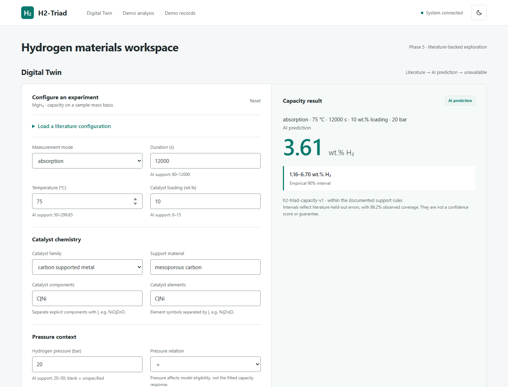
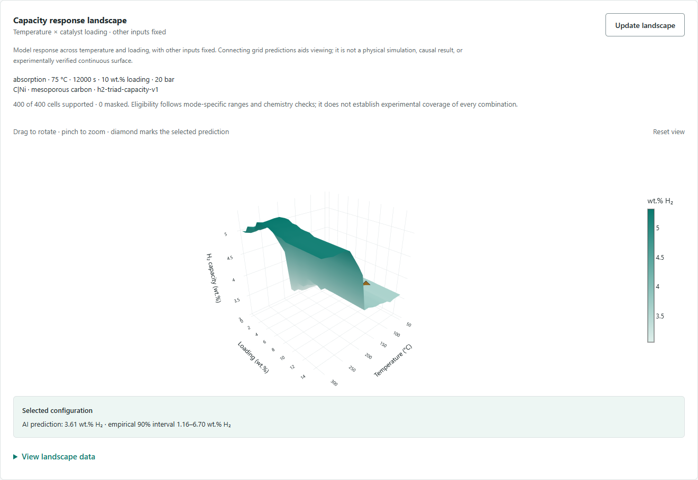
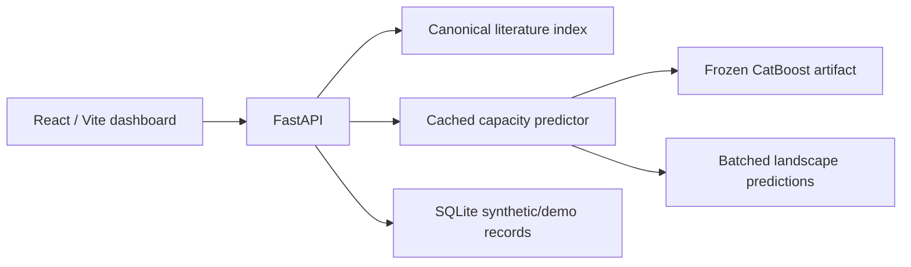

# H2-Triad

**Digital Twin for the HydraX Tri-Interface Catalyst project**

**Live Demo:** [https://hydrax-h2-triad.up.railway.app](https://hydrax-h2-triad.up.railway.app)

**GitHub Repository:** [https://github.com/YahyaAlsharif/h2-triad](https://github.com/YahyaAlsharif/h2-triad)

H2-Triad is a literature-first workspace for exploring hydrogen storage in MgH₂
materials. **HydraX Tri-Interface Catalyst** is the registered hackathon project
title.

Hydrogen-storage results depend on catalyst chemistry, preparation, temperature,
pressure, and measurement time. H2-Triad brings reported evidence and a small,
validated predictive model into one Digital Twin: configure an experiment,
retrieve matching literature, or estimate supported hydrogen capacity with
visible uncertainty and provenance.

## What it does

**Exact literature measurement → supported AI prediction → unavailable.**

- Retrieves verified sample observations with DOI, source locators, and original
  approximate/threshold qualifiers. Missing conditions are never wildcards.
- Predicts absorption/desorption capacity inside explicit support boundaries.
- Shows empirical 90% intervals, support warnings, and model identity.
- Maps predicted capacity across **temperature × catalyst loading** in an
  interactive 3D landscape. Other conditions stay fixed; unsupported cells stay
  empty. An accessible data table accompanies the plot.
- Keeps the **Synthetic/demo explorer** separate from scientific evidence and
  training data.

This Digital Twin is a predictive response workspace, not a physical or molecular
simulation, laboratory validation, or proof of causal optimization.

## Evidence and limitations

| Evidence | Current result |
| --- | ---: |
| Accessible core literature observations | **119** |
| Model-training observations | **109** |
| Independent training papers / samples | **16 / 36** |
| Paper-held-out MAE | **1.1693 wt.% H₂** |
| Paper-held-out RMSE | **1.5493 wt.% H₂** |
| Paper-held-out R² | **0.3314** |
| Empirical 90% interval: observed held-out coverage | **86.2%** |

Evaluation holds out entire papers rather than randomly splitting correlated
rows. The dataset is small and concentrated in particular journals and catalyst
families. Intervals are broad (mean width **5.0876 wt.% H₂**); unfamiliar chemistry
and combinations within numeric ranges remain uncertain. There is **no independent
laboratory validation**. Reported room temperature is not assigned an invented
number. Activation-energy prediction is deferred.

See the [model card](model/MODEL_CARD.md) for per-mode metrics, exclusions,
support rules, and failure modes.

## Application

The Railway production deployment is complete. Open the
[public demo](https://hydrax-h2-triad.up.railway.app); the images below are actual
application captures.





## Architecture



`frontend/` contains the UI; `backend/` serves scientific and demo APIs;
`data/phase4_dataset/` contains canonical/processed evidence; `model/` contains
inference, the trained artifact, and evaluation records. Raw papers are not
needed to run the application. [Documentation index](docs/README.md).

## Quick start

Use **Python 3.10** and **Node.js 24**. The model uses a pinned inference stack.
From the repository root:

```sh
python3.10 -m venv model/.venv
model/.venv/bin/python -m pip install -r backend/requirements.txt
model/.venv/bin/python -m uvicorn app.main:app --app-dir backend --reload
```

Windows PowerShell: use `py -3.10 -m venv model/.venv`, then
`model/.venv/Scripts/python.exe` in place of `model/.venv/bin/python`.
In a second terminal:

```sh
npm ci --prefix frontend
npm run dev --prefix frontend
```

On Windows, `npm.cmd` can be used when PowerShell blocks `npm.ps1`.
Open **http://localhost:5173**; API documentation is at
**http://localhost:8000/docs**. Defaults need no `.env` file. `.env.example`
contains only optional database/seed settings, never credentials.

### Docker: local integration

```sh
docker compose config --quiet
docker compose up --build -d
```

Use the same URLs. The `backend_data` volume preserves demo SQLite data.
`SEED_DEMO_DATA=false` affects only initialization of a new database; it never
removes existing records. Keep Compose database overrides inside `/app/data`.
Stop with `docker compose down` (without `--volumes` to retain data).

Compose currently serves the frontend through Vite's development server.

### Production container

The root `Dockerfile` is the production path: Node 24 builds the React app, then
a Python 3.10 slim image runs one Uvicorn worker. FastAPI serves both the bundled
SPA and `/api` routes on port 8000; the Vite development workflow above remains
unchanged.

This container is deployed as the public Railway service at
[https://hydrax-h2-triad.up.railway.app](https://hydrax-h2-triad.up.railway.app).

```sh
docker build -t h2-triad .
docker run --rm -e PORT=8000 -p 8000:8000 h2-triad
```

Open **http://localhost:8000**. The default SQLite demo database is intentionally
ephemeral in this container; scientific literature and prediction artifacts are
read-only image assets and do not require persistent storage.

For the one-service Railway setup and exact dashboard settings, see the
[Phase 6B Railway deployment guide](docs/phase-6b-railway.md).

## Methodology and provenance

- [Phase 4A extraction and eligibility](docs/phase-4a-scientific-dataset.md)
- [Dataset schema and units](data/phase4_dataset/schema.md)
- [Phase 4B paper-held-out evaluation](docs/phase-4b-capacity-model.md)
- [Model card](model/MODEL_CARD.md)
- [Phase 5 result hierarchy and architecture](docs/phase-5-ai-integration.md)
- [Source records and independent PDF acquisition](data/phase4_data_sources/README.md)

Scientific tables and the production model retain their Phase 5 fingerprints.
Provenance identifiers are not model features. Synthetic/demo, cycling,
activation-energy, thermal-event, and extended-composite observations do not
enter the capacity training view.

## Validation

Phase 5 recorded **22 model, 72 backend, and 26 browser tests**, with all
26 browser tests also passing against Compose. [Phase 6A release validation](docs/phase-6a-release.md)
records the current checks and the deliberately skipped, opt-in refitting test.

```sh
model/.venv/bin/python -m pip install -r model/requirements.txt -r backend/requirements.txt
model/.venv/bin/python -m pytest model/tests -q
model/.venv/bin/python -m pytest backend -q
model/.venv/bin/python scripts/release/inference_smoke.py
npm ci --prefix scripts/phase4
npm test --prefix scripts/phase4
npm run lint --prefix frontend
npm run format:check --prefix frontend
npm run build --prefix frontend
npm test --prefix frontend
```

Browser tests use installed Chrome by default and an isolated temporary database
on ports 8001/5174. For Playwright Chromium, run `npx playwright install chromium`
from `frontend/` and set `PLAYWRIGHT_CHANNEL=chromium`. `PLAYWRIGHT_PYTHON`
can select the interpreter. Screenshots/traces from tests are ignored.

Ordinary validation performs no model training and does not overwrite scientific
outputs. Dataset validation regenerates CSV/Parquet in a temporary directory and
compares bytes. Optional private PDF verification is documented with source rights.

## License and source rights

Original H2-Triad software and original documentation are [MIT licensed](LICENSE).
**The MIT license does not cover curated scientific datasets, trained weights,
research publications, publisher supplements, or dependencies.** Dataset/model
licensing decisions and removal of historical source copies remain release gates.
Read [licensing, data, and provenance boundaries](docs/licensing-and-data.md).
